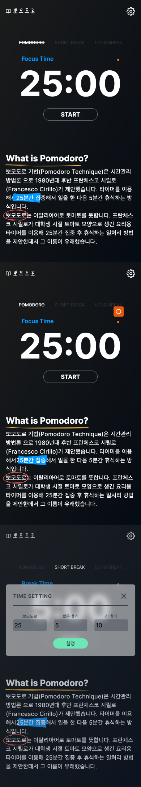

<h1>마이 뽀모도로앱</h1>

마이 뽀모도로앱은 기본에 충실한 시간관리 어플입니다.

- 활용도 - 코딩공부에 효율적으로 집중😅하기 위해 만들었습니다.
- 학습기회 - Next.js와 Tailwind css를 학습하고 적용해봅니다.

### [<u>View live.</u>](https://pomodoro-app-rose.vercel.app/)

 

## Tech

- [Next.js] - 서버사이드렌더링을 쉽게 구현할 수 있고 유연하게 제작이 가능한 리액트 프레임워크 Next.js를 사용하였습니다.
- [tailwind css] - 유틸리티 우선 CSS 프레임워크 tailwind css를 사용하였습니다.
- [Vercel] - Next.js에 최적화가 되어있는 Vercel로 배포를 하였습니다.

## Library

- [Rough notation] 스케치 느낌의 하이라이트 애니메이션을 적용하는 JavaScript 라이브러리입니다.
  뽀모도로 앱에 잘 맞는 애니메이션 요소라고 생각해서 적용하였습니다.

## Features

- 뽀모도로 모드, 짧은 휴식모드, 긴 휴식 모드를 선택할 수 있습니다.
- 사용자는 뽀모도로/휴식 시간을 자유롭게 설정할 수 있습니다.
- 설정된 시간이 지나면 알람이 울립니다.
- 설정된 모드에서 벗어나려고 하면 알림창으로 재확인합니다.
- 페이지를 새로고침하는 경우에도 확인 후 진행되어 실수로 인한 페이지이탈을 막습니다.

 

---

</img>

[next.js]: https://nextjs.org
[tailwind css]: https://tailwindcss.com
[vercel]: https://vercel.com
[rough notation]: https://roughnotation.com/
